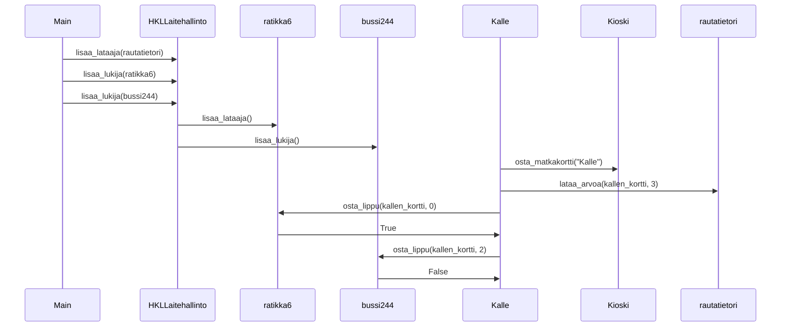

```mermaid
 sequenceDiagram
    

    Main ->> HKLLaitehallinto: lisaa_lataaja(rautatietori)
    Main ->> HKLLaitehallinto: lisaa_lukija(ratikka6)
    Main ->> HKLLaitehallinto: lisaa_lukija(bussi244) 
    HKLLaitehallinto ->> ratikka6: lisaa_lataaja()
    HKLLaitehallinto ->> bussi244: lisaa_lukija()
    Kalle ->> Kioski: osta_matkakortti("Kalle")
    Kalle ->> rautatietori: lataa_arvoa(kallen_kortti, 3)
    Kalle ->> ratikka6: osta_lippu(kallen_kortti, 0)
    ratikka6 ->> Kalle: True
    Kalle ->> bussi244: osta_lippu(kallen_kortti, 2)
    bussi244 ->> Kalle: False
```
