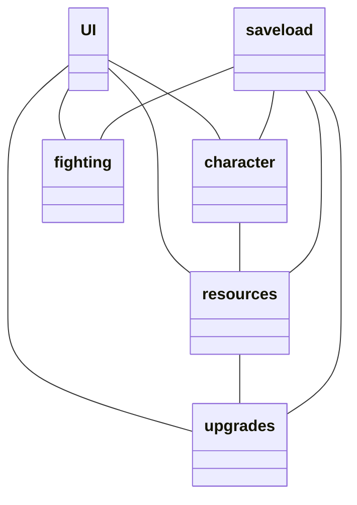

 # Arkkitehtuuri
 
 ## Luokkakaavio

`UI` on yllättäen käyttöliittymästä vastaaa luokka. Käyttöliittymä sisältää yhden näkymän.

`resources`-luokka luo olion jota käytetään `character`- ja `upgrades`-luokan asioiden ostamisessa. Lisäksi tämä luokka vastaa resurssien (itsensä attribuutin) passiivisesta tuotosta `increase` metodin kautta.

`upgrades`-luokka käsittelee `resources`-luokan passiivisen tuoton kasvattamisesta. Tämä tedään `buy`-metodin kautta joka, jolle annetaan `resources`-luokan objekti.

`character`-luokka vastaa kyvyistä ja niiden päivittämisestä. Luokan objekti sisältää `statblock` attribuutin, jota voidaan käsitellä luokan `upgrade`- ja `unupgrade`-metodien kautta. Lisäksi luokka käsittelee AP:n (myös luokan attribuutti) ostoa `buy_ap`-metodin kautta, jolle annettaan `resources`-luokan objekti.

`fighting`-luokka käsittelee vihollista ja pelaajan välisestä kamppailusta sen kanssa. Lisäksi luokassa muutetaan `character`-luokan `statblock`-attribuutti vihollisten taistelua vastaan käytettävään `character_power` muotoon.

 ## Tietojen tallennus
 Tiedot tallennetaan `savedata.txt`-tiedostoon `savedata`-luokan `save`-metodilla. Tiedosto on formatoitu, jotta sen käsittely olisi mahdollisimman helppoa saman luokan `load`-metodilla, jolle annetaan kaikkien muiden luokkien (paitsi UI) objektit joita se muuttaa. Tiedoston eri rivit ovat selitetty läpi käyttöohjeessa.
