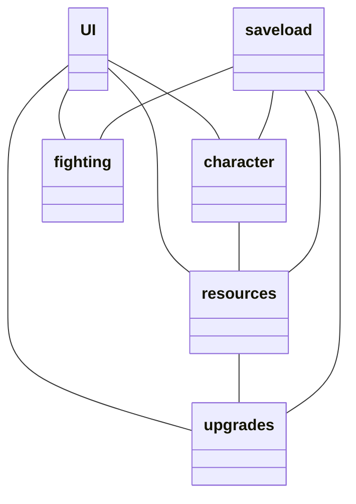

 # Arkkitehtuuri
 
 ## Luokkakaavio

`UI` on yllättäen käyttöliittymästä vastaaa luokka. Käyttöliittymä sisältää yhden näkymän.

`resources`-luokka luo olion jota käytetään `character`- ja `upgrades`-luokan asioiden ostamisessa. Lisäksi tämä luokka vastaa resurssien (itsensä) passiivisesta tuotosta `increase()` metodin kautta.
